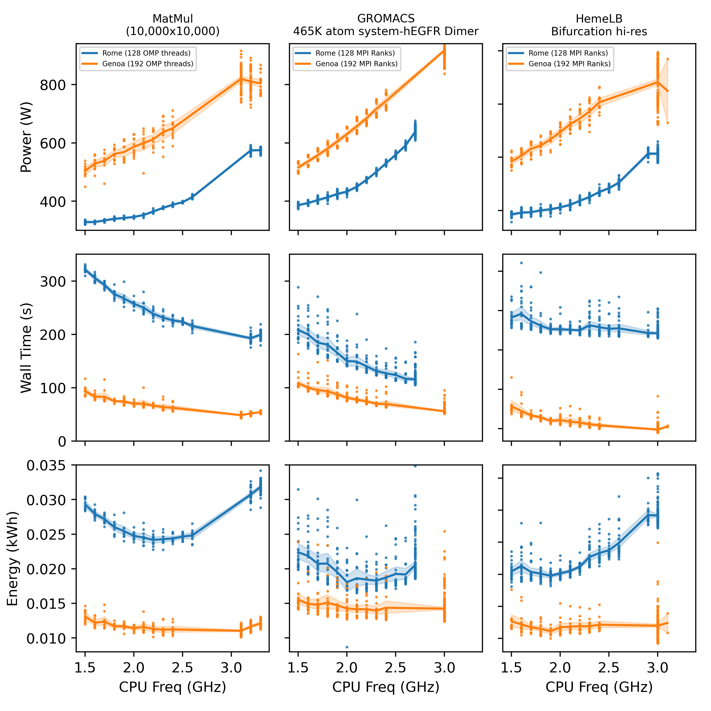

# Dynamic frequency scaling (DVFS)

Dynamic frequency scaling (also known as CPU throttling) is a power management technique in computer architecture whereby the frequency of a microprocessor can be automatically adjusted "on the fly" depending on the actual needs, to conserve power and reduce the amount of heat generated by the chip (wikipedia https://en.wikipedia.org/wiki/Dynamic_frequency_scaling). 




# How to do it on Snellius

Since Snellius is a shared public machine. It is not so easy to change CPU Freqs dynamically. So we will achieve this via the EAR daemon (which is running on all of the nodes)

```
srun --ear-cpufreq=1500000 --ear-policy=monitoring --ear-verbose=1 ./executable
```

# Hands-on sessions


## 1. Find the most energy efficient CPU frequency for the NPB sp-mz.D.x

### Use the jobscripts
1. [dvfs_NPB_example_1.sh](https://github.com/sara-nl/energy-efficient-computing/blob/main/tutorials/dvfs/dvfs_NPB_example_1.sh)

2. [dvfs_NPB_example_2.sh](https://github.com/sara-nl/energy-efficient-computing/blob/main/tutorials/dvfs/dvfs_NPB_example_2.sh)
    
