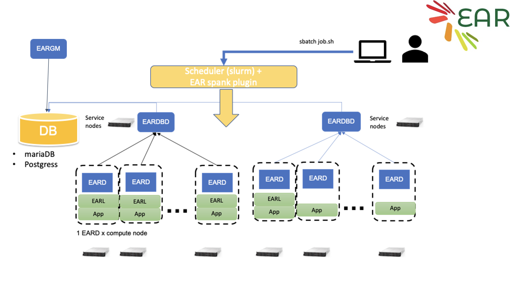
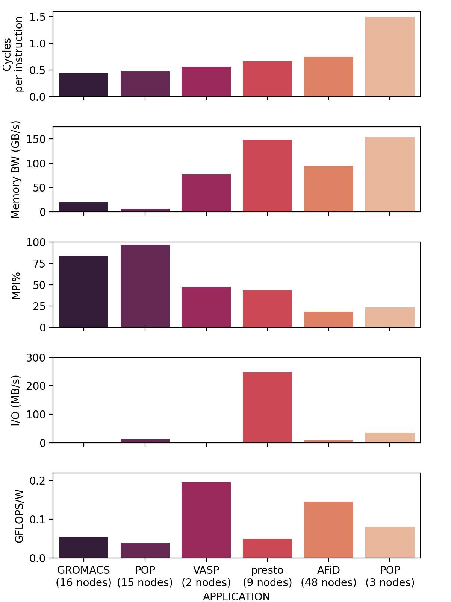

# Energy Aware Runtime (EAR) Monitoring Tutorial

>EAR documentation for use on Snellius here: https://servicedesk.surf.nl/wiki/pages/viewpage.action?pageId=62226671
>
>EAR full documentation can be found here https://gitlab.bsc.es/ear_team/ear/-/wikis/home

# Section Outline

1. [Introduction](#introduction)
2. [EARL](#earl)
3. [Tools](#tools)
4. [Exercises](#Exercises)
    - [Applications](#applications) 


## Introduction

The Energy Aware Runtime (EAR) package provides an energy management framework for super computers. This tutorial covers the "end-user" experience with EAR.

EAR usage on Snellius can be decomposed into two "services." 

1. The EAR library (EARL): EARL is loaded (at runtime) when launching an application through the EAR Loader (EARLO) and SLURM plugin (EARPLUG). The EARL provides functionality to monitor energy (and performance) metrics of an application and additionally the ability to select the optimal CPU frequency according to the application and the node characteristics. 

2. Tools: Which include Job accounting (via the command eacct) which queries energy information of a particular job or list of jobs from the the EAR database (EAR DB) on Snellius.



### EARD: Node Manager
The node daemon is the component in charge of providing any kind of services that requires privileged capabilities. Current version is conceived as an external process executed with root privileges.
The EARD provides the following services, each one covered by one thread:

Provides privileged metrics to EARL such as the average frequency, uncore integrated memory controller counters to compute the memory bandwidth, as well as energy metrics (DC node, DRAM and package energy).
Implements a periodic power monitoring service. This service allows EAR package to control the total energy consumed in the system.
Offers a remote API used by EARplug, EARGM and EAR commands. This API accepts requests such as get the system status, change policy settings or notify new job/end job events.


## EARL

The EAR Library is automatically loaded with MPI applications when EAR is enabled. EAR supports the utilization of both mpirun/mpiexec and srun commands.
To enable EAR in your job script when launching an MPI application you will need to include the following SBATCH options in your job script.

`srun` is the preferred job launcher when using EAR, as the EARL is a SLURM plugin! You will collect the largest amount of energy metrics when using srun
Running MPI applications with EARL is automatic for SLURM systems when using srun. All the jobs are monitored by EAR and the Library is loaded by default when EAR is enabled in the job script. To run a job with srun and EARL there is no need to load the EAR module. When using slurm commands for job submission, both Intel and OpenMPI implementations are supported. When using sbatch/srun or salloc to submit a job, Intel MPI and OpenMPI are supported.


### Example usage in a batch script

```
#SBATCH --ear=on
#SBATCH --ear-policy=monitoring
```

Example:
```bash
#!/bin/bash
 
#SBATCH -p rome
#SBATCH -t 00:30:00
#SBATCH --ntasks=128
 
#SBATCH --ear=on
#SBATCH --ear-policy=monitoring
#SBATCH --ear-verbose=1
 
srun myapplication
```


<h2 id="tools">EAR Tools</h2>

EAR is available on Snellius as a module
```
module load 2022
module load ear
```
### Job accounting (eacct)
The eacct command shows accounting information stored in the EAR DB for jobs (and step) IDs. The command uses EAR’s configuration file to determine if the user running it is privileged or not, as non-privileged users can only access their information. It provides the following options. The ear module needs to be loaded to use the eacct command.

eacct example usage
The basic usage of eacct retrieves the last 20 applications (by default) of the user executing it. The default behavior shows data from each job-step, aggregating the values from each node in said job-step. If using SLURM as a job manager, a sbatch job-step is created with the data from the entire execution. A specific job may be specified with -j option:

Default: Show the last 20 jobs (maximum) executed by the user.
```
eacct
```
Query a specific job
```
eacct -J 123456789
```
Query a specific job-step
```
eacct -J 123456789.0
```
Show metrics (averaged per job.stepid) from 3 jobs
```
eacct -j 175966,175967,175968
```

#### Important Options
 - `-l` shows the information for each node for each job instead of the global statistics for said job.
 - `-r` shows the EAR loop signatures. Users, job ids, and step ids can be specified as if were showing job information.
 - `-c` specifies the file where the output will be stored in CSV format. If the argument is "no_file" the output will be printed to STDOUT [default: off]


### Example:

```
squeue
             JOBID PARTITION     NAME     USER ST       TIME  NODES NODELIST(REASON)
           2884239      rome ear_sbat benjamic  R       2:19      1 tcn352
```

```
[benjamic@int4 EAR]$ eacct -j 2884239
    JOB-STEP USER       APPLICATION      POLICY NODES AVG/DEF/IMC(GHz) TIME(s)    POWER(W) GBS     CPI   ENERGY(J)    GFLOPS/W IO(MBs) MPI%  G-POW (T/U)   G-FREQ  G-UTIL(G/MEM)
2884239-sb   benjamic   ear_sbatch_GROMA MO     1     2.57/2.60/---    386.00     596.51   ---     ---   230253       ---      ---     ---   ---           ---     ---          
2884239-0    benjamic   ear_sbatch_GROMA MO     1     2.57/2.60/1.47   348.64     617.18   8.33    0.33  215175       0.2930   0.3     77.6  0.00/---      ---     --- 
```

### Application Characterization

EAR is not only a tool that will throttle CPU Freqs, but it also allows you to collect "traces" of your application, and characterize it. This is especially handy for large many node jobs, that often prove difficult to profile. In this way EAR is also a "light-weight" profiler for large applications.

The image below illustrates the usage of EAR to show the characteristics of a variety of multi-node CPU based applications side by side. This information can be obtained via the `monitoring` policy in EAR, and visualized with the `eacct` tool.




## Exercises
Choose an application from the list [below](#applications)
### 1. Monitor an application with EAR
### 2. Identify whether the applicaiton is CPU intensive or Memory/Communication intensive
### 3. Play with PyTorch Automatic Mixed Precision, and maybe model "size". What impacts on Energy does this have?


## Applications

All of the Applications used in this tutorial can be found in the project space `/projects/0/energy-course/`

1. [Synthetic Applications](#synthetic-applications)
2. [Scientific Applications](#scientific-applications)
   - [HemePure](#hemepure)
   - [Palabos](#Palabos)
   - [GROMACS](#GROMACS)
   - [PyTorch](#PyTorch)


## Synthetic Applications
### NAS Parallel Benchmarks (NPB3.4-MZ MPI+OpenMP) - SP-MZ Benchmark
> The NAS Parallel Benchmarks (NPB) are a small set of programs designed to help evaluate the performance of parallel supercomputers. The benchmarks are derived from computational fluid dynamics (CFD) applications https://www.nas.nasa.gov/software/npb.html


In this course we will use the "Multi-zone versions of NPB" (NPB-MZ). These are designed to exploit multiple levels of parallelism in applications and to test the effectiveness of multi-level and hybrid parallelization (MPI-OpenMP) paradigms and tools. Specifically we use the SP-MZ (even-size zones within a problem class, increased number of zones as problem class grows).

##### Problem Sizes:

| Class     | Mesh size (x)  | Mesh size (y)  | Mesh size (z)  |
| ----------- | ----------- | ----------- | ----------- |
| C | 240 | 320 | 28 |
| D | 1632  | 1216 | 34 |

Example jobscript
[NPB_job.sh](https://github.com/sara-nl/energy-efficient-computing/blob/main/tutorials/monitoring_ear/NPB_job.sh)


## Scientific Applications
### HemePure
> HemePure/HemeLB developed by the team of Prof Peter Coveney at University College London (UCL), is a software pipeline that simulates blood flow. HemePure is specifically designed to efficiently handle sparse topologies, supports real-time visualization and remote steering of the simulation and can handle fully resolved realistic vessels like those found in the human brain. https://github.com/UCL-CCS/HemePure        
https://github.com/UCL-CCS/HemePure-GPU

* The executables are located in the directory `/projects/0/energy-course/HemePure`. There you will find the `hemepure` and `hemepure_gpu` (CUDA enabled) exectubles.
**How to run a case**
We will be running through an example of pressure driven flow through a bifurcation available in the HemeLB download.

CPU example jobscript
[hemepure_cpu_job.sh](https://github.com/sara-nl/energy-efficient-computing/blob/main/tutorials/monitoring_ear/hemepure_cpu_job.sh)

GPU example jobscript
[hemepure_gpu_job.sh](https://github.com/sara-nl/energy-efficient-computing/blob/main/tutorials/monitoring_ear/hemepure_gpu_job.sh)

### Palabos

> The Palabos (Parallel Lattice Boltzmann Solver) library is a framework for general-purpose computational fluid dynamics (CFD), with a kernel based on the lattice Boltzmann method. The case we use in this course is a simulation of blood flow in a inside the 3D aneurysm geometry. https://palabos.unige.ch/

example jobscript
[palabos_job.sh](https://github.com/sara-nl/energy-efficient-computing/blob/main/tutorials/monitoring_ear/palabos_job.sh)


### GROMACS
> **GROMACS** A free and open-source software suite for high-performance molecular dynamics and output analysis.
#### The HECBioSim Benchmarks (https://www.hecbiosim.ac.uk/access-hpc/benchmarks)
> **HECBioSim benchmark suite** consists of a set of simple benchmarks for a number of popular Molecular Dynamics (MD) engines, each of which is set at a different atom count. The benchmark suite currently contains benchmarks for the AMBER, GROMACS, LAMMPS and NAMD molecular dynamics packages.

In this example we will choose the "465K atom system - hEGFR Dimer of 1IVO and 1NQL" simulation (which can be found here https://github.com/victorusu/GROMACS_Benchmark_Suite/tree/1.0.0/HECBioSim/hEGFRDimer). This simulation contains a total number of atoms = 465,399 (Protein atoms = 21,749  Lipid atoms = 134,268  Water atoms = 309,087  Ions = 295). The run will take about 10 minutes to execute (using all 128 cores of an AMD ROME node). The image below shows the simulation that we will run.

- **20K atom system** 
```
curl -LJ https://github.com/victorusu/GROMACS_Benchmark_Suite/raw/1.0.0/HECBioSim/Crambin/benchmark.tpr -o Crambin_benchmark.tpr
```
- **1.4M atom system** 
``` 
curl -LJ https://github.com/victorusu/GROMACS_Benchmark_Suite/raw/1.0.0/HECBioSim/hEGFRDimerPair/benchmark.tpr -o hEGFRDimerPair_benchmark.tpr
``` 
- **3M atom system** 
```
curl -LJ https://github.com/victorusu/GROMACS_Benchmark_Suite/raw/1.0.0/HECBioSim/hEGFRDimerSmallerPL/benchmark.tpr -o hEGFRDimerSmallerPL_benchmark.tpr
```


### PyTorch
> The ResNet model is based on the Deep Residual Learning for Image Recognition from this paper https://arxiv.org/abs/1512.03385 
https://pytorch.org/hub/pytorch_vision_resnet/

**torchvision should be installed in your environment first**

Example how to install 2023
```
module load 2023
module load PyTorch/2.1.2-foss-2023a-CUDA-12.1.1
pip install torchvision==0.16.2
```

Example jobscript
[PyTorch_job.sh](https://github.com/sara-nl/energy-efficient-computing/blob/main/tutorials/monitoring_ear/PyTorch_job.sh)

