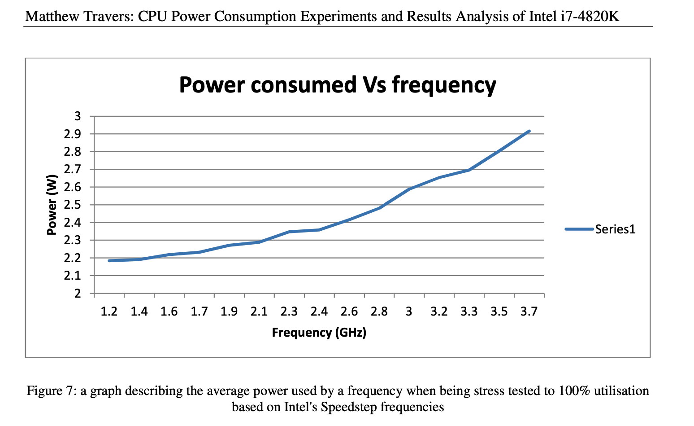
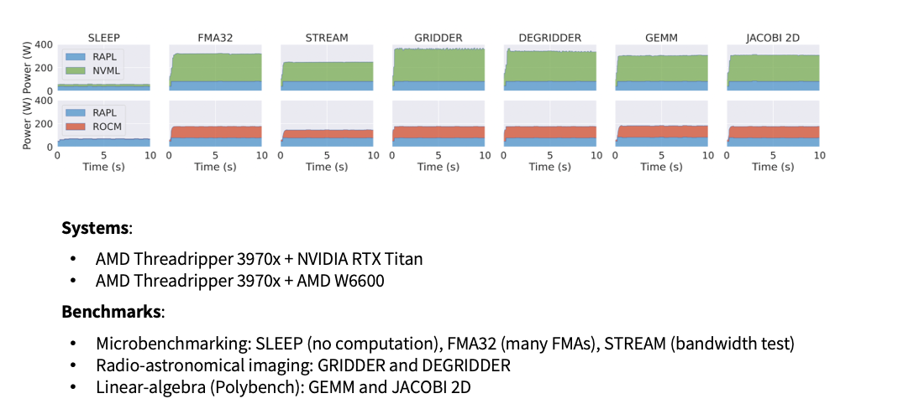

# Energy and power monitoring hands on session:
## Section Outline

1. [Basic Concepts](#basic-concepts)
2. [Linux tools](#linux-tools)
3. [Profilers](#profilers)
4. [Libraries](#libraries)
5. [Exercises](#exercise)


## Basic Concepts

### What is Power? What is Energy? And how do I control it?

 -  **Power (W or kW)** is the rate of doing work, measured in Watts, and is represented by the letter P. It is an "instantaneous" unit. It gives you an idea of how much work can be done in a unit of time. 

    - Lighthouse light bulb ~ 1000 W
    - Reading light  bulb ~ 15 W

 -  **Energy (Joule or KWh)** is the combination of current (I) and electric potential (V) that is delivered by a circuit. It can be thought of the amount of Power delivered by a circuit over a period of time... It is often measured in daily appliances (and your energy bill) as kilowatt-hour (kWh). 

    - Energy required to run the Light house for a minute .... 0.016 kWh
    - Energy required to run the reading light for an hour .... 0.015 kWh

Do we optimize for Power or for Energy?

> 1. "Turn off the Power" ... Eliminate the power consumption of a subsystem (a core or other resources like clock or cache) by completely powering it down (so cutting down the voltage, reducing it to zero)
>
> 2. "Scale the Frequency" ... Decrease the power consumption by decreasing the voltage and/or the frequency of the subsystem and/or the whole processor
>
> Source (Mete Balci (https://metebalci.com))


### How does Power scale with Frequency?


The power consumption of an integrated circuit (such as a processor) is proportional linearly to frequency and quadratically to voltage.

**P ~ f V²**


> Image Source: "CPU Power Consumption Experiments and Results Analysis of Intel i7-4820K" Matthew Travers m.travers@newcastle.ac.uk

### What is Frequency?

The Frequency or "clock speed" of your CPU is a measure of the number of cycles a CPU executes per second. This value is measured in GHz (gigahertz). A “cycle” (also called a instruction cycle or fetch-execute cycle) is the basic unit of operation that a CPU does to "compute". During each cycle, billions of transistors within the processor open and close . This is how the CPU executes the calculations contained in the instructions it receives.


### C-States/P-States
CPU Idle States or C-states in a x86 architecture support various states in which parts of the CPU are deactivated or run at lower performance settings. This allows systems to save power by partially deactivating CPUs that are not in use.

    There are several Core States, or C-states, that an AMD EPYC processor can idle within:
    •   C0: active. This is the active state while running an application.
    •   C1: idle
    •   C2: idle and power gated. This is a deeper sleep state and will have a greater latency when moving back to the C0 state compared with when the CPU is coming out of C1.

P-states means the CPU core is also in C0 state because it has to be powered to execute a code. P-states basically allow to change the voltage and frequency (in other words operating point) of the CPU core to decrease the power consumption. There are a set of P-states which corresponds to different operating points (voltage-frequency pairs), and a P-state refers one such operating point. The highest (frequency and voltage) operating point is the maximum performance state which is P0.
#### AMD EPYC (Zen2+) P-states 
```
Highest Perf ------>+-----------------------+                         +-----------------------+
                    |                       |                         |                       |
                    |                       |                         |                       |
                    |                       |          Max Perf  ---->|                       |
                    |                       |                         |                       |
                    |                       |                         |                       |
Nominal Perf ------>+-----------------------+                         +-----------------------+
                    |                       |                         |                       |
                    |                       |                         |                       |
                    |                       |                         |                       |
                    |                       |                         |                       |
                    |                       |                         |                       |
                    |                       |                         |                       |
                    |                       |      Desired Perf  ---->|                       |
                    |                       |                         |                       |
                    |                       |                         |                       |
                    |                       |                         |                       |
                    |                       |                         |                       |
                    |                       |                         |                       |
                    |                       |                         |                       |
                    |                       |                         |                       |
                    |                       |                         |                       |
                    |                       |                         |                       |
 Lowest non-        |                       |                         |                       |
 linear perf ------>+-----------------------+                         +-----------------------+
                    |                       |                         |                       |
                    |                       |       Lowest perf  ---->|                       |
                    |                       |                         |                       |
 Lowest perf ------>+-----------------------+                         +-----------------------+
                    |                       |                         |                       |
                    |                       |                         |                       |
                    |                       |                         |                       |
         0   ------>+-----------------------+                         +-----------------------+

                                    AMD P-States Performance Scale

```

## Linux tools

In order to get an overview of the CPU architecture of the physical (host) system use the linux tool `lscpu`. 
```
lscpu 
```

You can look at the device files that show you the current and available frequencies of your CPU. Lets look at CPU #0 for example....

- List the available Freqs.
    - ``` cat /sys/devices/system/cpu/cpu0/cpufreq/scaling_available_frequencies ```
- List the maximum Freq.
    - ```  cat /sys/devices/system/cpu/cpu0/cpufreq/cpuinfo_max_freq ```
- List the minimum Freq.
    - ```  cat /sys/devices/system/cpu/cpu0/cpufreq/cpuinfo_min_freq ```
- List the current Freq.
    - ``` cat /sys/devices/system/cpu/cpu0/cpufreq/scaling_cur_freq ```
- Better ... watch the cpufreq it in realtime...
    - ```  watch -n 0.1 cat /sys/devices/system/cpu/cpu0*/cpufreq/scaling_cur_freq ```

This is can be accessed more easily with the linux tool `cpupower`
```
cpupower -c 0 frequency-info
```
or watch it live
```
watch -n 0.1 cpupower -c 0 frequency-info
```


## Profilers


> <mark style="background: #FF0800!important">**!!!! **Attention** !!!!**</mark>
>
> You need special privileges in order to access the "all" of the hardware counters.
to do this on Snellius submit a job with the constraint..                         
> `--constraint=hwperf`
>
> EXAMPLE USAGE:
>```
>salloc -p thin --exclusive -t 04:00:00 --constraint=hwperf
>```

### AMD uProf

AMD uProf (“MICRO-prof”) is a software profiling analysis tool for x86 applications running on Windows, Linux and FreeBSD operating systems and provides event information unique to the AMD “Zen”-based processors and AMD INSTINCT™ MI Series accelerators. AMD uProf enables the developer to better understand the limiters of application performance and evaluate improvements.

Read more about AMD uProf here https://www.amd.com/en/developer/uprof.html

AMD uProf is also installed on Snellius....

```
module load 2022
module load AMD-uProf/4.1.424
```

```
AMDuProfCLI is a command-line tool for AMD uProf Profiler.

Usage: AMDuProfCLI [--version] [--help] COMMAND [<Options>] <PROGRAM> [<ARGS>]

Following are the supported COMMANDs:
  collect       Run the given program and collects the profile samples.
  timechart     Collects the system characteristics like power, thermal and frequency.
  report        Process the profile-data file and generates the profile report.
  translate     Process the raw profile-data files and save those into database files.
  info          Displays generic information about system, CPU etc.

PROGRAM
  The launch application to be profiled.

ARGS
  The list of arguments for the launch application.

Run 'AMDuProfCLI COMMAND -h' for more information on a specific command.
```

### Interesting commands

Display system information
```
AMDuProfCLI info --system
```
List the available "events"
```
AMDuProfCLI info --list predefined-events
```
List predefined profiles
```
AMDuProfCLI info --list collect-configs
```
List the available "system events" available from timechart
```
AMDuProfCLI timechart --list
```

### Example Excersizes

1. Profile specific core/s power and set the affinity of the program to the core..
```
AMDuProfCLI timechart --event core=0-3,power -o AMDuProf_output --interval 10 --affinity 1 ./bin/dgemm 500
```
2. Profile the Frequency?
3. Profile Temperature?

### LIKWID (“Like I Knew What I’m Doing.”)
> https://github.com/RRZE-HPC/likwid

analogous to AMDuProf.
```
module load 2022
module load likwid/5.2.2-GCC-11.3.0

likwid-perfctr -g ENERGY -C 1 ../bin/dgemm 500
 ```

Since LIKWID is a non "native" AMD tool it requires a special daemon to access the readable and writeable MSR device files, https://github.com/RRZE-HPC/likwid/wiki/likwid-accessD . Since Snellius is a public shared (Mostly AMD machine) we will stick to the AMD tooling.


## Libraries

### 1. PMT ([Power Measurement Toolkit](https://git.astron.nl/RD/pmt/)) 

PMT is a high-level software library capable of collecting power consumption measurements on various hardware. The library provides a standard interface to easily measure the energy use of devices such as CPUs and GPUs in critical application sections.

#### Capabilities:


> Image Source: 
https://doi.org/10.48550/arXiv.2210.03724

PMT can be seen as a library which calls "lower level" libraries that allow reporting the energy consumption of various system-on-chip power domains. PMt supports the following Hardware/Libraries:

- RAPL (Running Average Power Limit)
- likwid
- NVML
- ROCM
- xilinx

For the CPU part of this course we will showcase the Rapl functionality.

#### C++ example:
```cpp
#include <pmt.h> // needed for PMT
#include <iostream> // needed for CPP IO ... cout, endl etc etc

// Initialize the Sensor
auto sensor = pmt::rapl::Rapl::create();

// Read from the PMT Sensor
auto start = sensor->read();

some_function_that_you_want_to_time();

// Read from the PMT Sensor
auto end = sensor->read();

std::cout<<"RESULTS-------"<<std::endl;
std::cout<<"Matrix Size: "<<ROWS<<std::endl;
std::cout <<"PMT Seconds: "<< pmt::PMT::seconds(start, end) << " s"<< std::endl;
std::cout <<"PMT Joules: " << pmt::PMT::joules(start, end) << " J" << std::endl;
std::cout <<"PMT Watts: " << pmt::PMT::watts(start, end) << " W" << std::endl;
```

#### Python example:

```python
import pypmt
from pypmt import joules, seconds, watts

# Initialize the Sensor
pmt = pypmt.Rapl.create()

# Read from the Sensor
start = pmt.read()

some_function_that_you_want_to_time()

# Read from the Sensor
end = pmt.read()

print("joules {}".format(pypmt.joules(start, end)))
print("watts {}".format(pypmt.watts(start, end)))
print("seconds {}".format(pypmt.seconds(start, end)))

```

#### It is available on Snellius

```
module load 2022
module avail pmt

pmt/1.2.0-GCCcore-11.3.0-CUDA-11.7.0    pmt/1.2.0-GCCcore-11.3.0
```

How to compile a c++ source code with PMT library: All you need to do is load the PMT module on Snellius and link to it ( `-lpmt`)  during compilation....

```
module purge
module load 2022
module load foss/2022a
module load pmt/1.2.0-GCCcore-11.3.0

g++ -fopenmp -lpmt example_program.cpp -o example_program
```

## Exercise
Load the 2023 GCC based toolchain
```
module load 2023
module load foss/2023a
module load CMake/3.26.3-GCCcore-12.3.0
module load pmt/1.2.0-GCCcore-12.3.0
```
Build:
```
mkdir build
cd build
cmake -DENABLE_PMT=1 ..
make install
```

The binaries will be installed in `energy-efficient-computing/tutorials/monitoring_general/bin`

Example dgemm usage:
> Serial 
```
./bin/dgemm_pmt 200
```
> OpenMP Parallel 
```
./bin/dgemm_pmt -p 200
```
> CUDA Enabled (with build instructions)
```
module load 2023
module load foss/2023a
module load CMake/3.26.3-GCCcore-12.3.0
module load CUDA/12.1.1
module load pmt/1.2.0-GCCcore-12.3.0-CUDA-12.1.1
```
Build (on a node with attached NVIDIA GPU's):
```
mkdir build
cd build
cmake -DENABLE_PMT=1 -DENABLE_CUDA=1 ..
make install
```
Run:
```
./bin/dgemm_pmt_gpu 2000 
```

