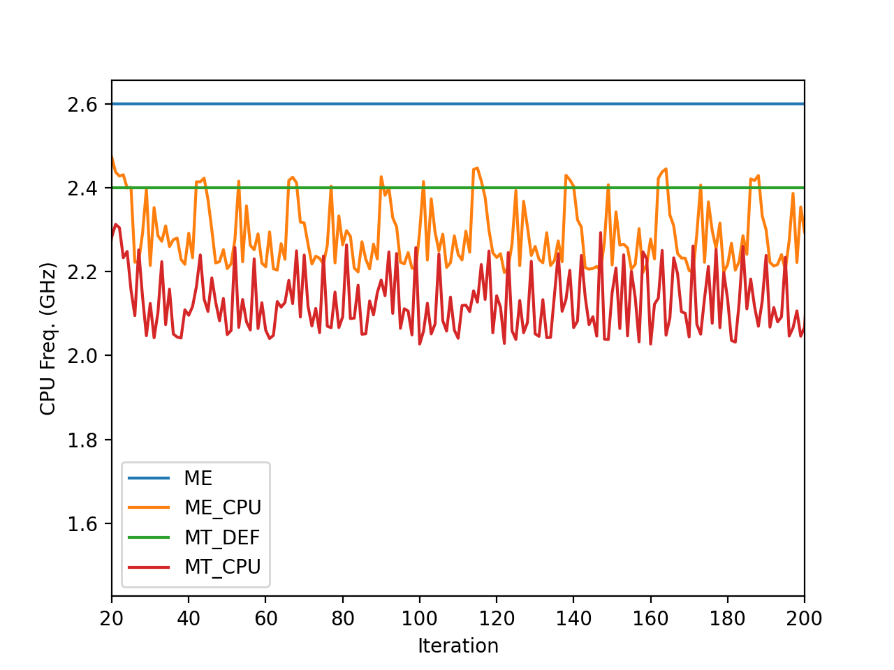
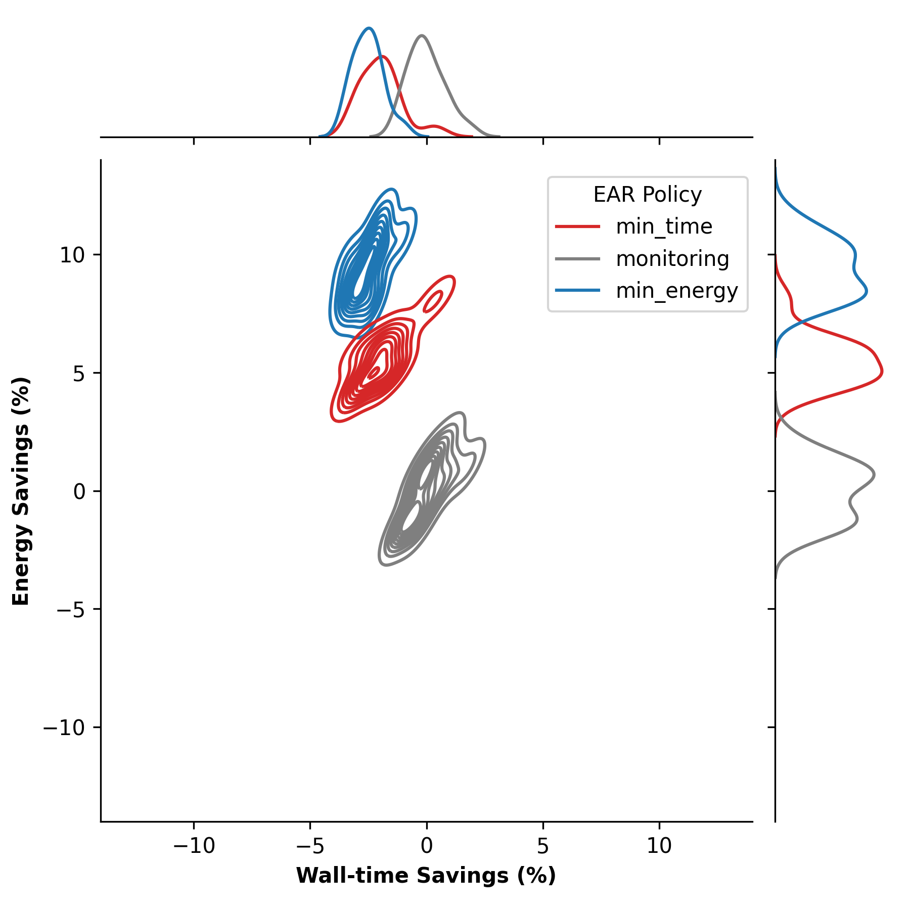

# EAR Energy Policy Tutorial

>EAR documentation for use on Snellius here: https://servicedesk.surf.nl/wiki/pages/viewpage.action?pageId=62226671
>
>EAR full documentation can be found here https://gitlab.bsc.es/ear_team/ear/-/wikis/home

## Section Outline

1. [Application Characterization](#application-characterization)
3. [EAR Policies](#ear-policies)
4. [Excersizes](#excersizes)


## Application Characterization

The Energy Aware Runtime (EAR) package provides an energy management framework for super computers. This tutorial covers the "end-user" experience with EAR.

EAR usage on Snellius can be decomposed into two "services." 

1. The EAR library (EARL): EARL is loaded (at runtime) when launching an application through the EAR Loader (EARLO) and SLURM plugin (EARPLUG). The EARL provides functionality to monitor energy (and performance) metrics of an application and additionally the ability to select the optimal CPU frequency according to the application and the node characteristics. 

2. Tools: Which include Job accounting (via the command eacct) which queries energy information of a particular job or list of jobs from the the EAR database (EAR DB) on Snellius.


### Application Characterization

EAR is not only a tool that will throttle CPU Freqs, but it also allows you to collect "traces" of your application, and characterize it. This is especially handy for large many node jobs, that often prove difficult to profile. In this way EAR is also a "light-weight" profiler for large applications.

The image below illustrates the usage of EAR to show the characteristics of a variety of multi-node CPU based applications side by side. This information can be obtained via the `monitoring` policy in EAR, and visualized with the `eacct` tool.


## EAR Policies

By understanding an application's characteristics we can try to "guess" at which Policy will be best suited for an application. 

EAR offers three energy policies plugins: min_energy, min_time and monitoring. The last one is not a power policy, is used just for application monitoring where CPU frequency is not modified (neither memory or GPU frequency).  For application analysis monitoringcan be used with specific CPU, memory and/or GPU frequencies.

The 2 optimization policies `min_time` and `min_energy` will tune the frequency for you. The energy policy is selected by setting the `--ear-policy=policy` option when submitting a SLURM job.

### min_energy 

The goal of this policy is to minimize the energy consumed with a limit to the performance degradation. 

This limit is set in the SLURM `--ear-policy-th` option or the configuration file. The `min_energy` policy will select the optimal frequency that minimizes energy enforcing (performance degradation <= parameter). When executing with this policy, applications starts at default frequency(specified at ear.conf).
```
PerfDegr = (CurrTime - PrevTime) / (PrevTime)
```

### min_time


The goal of this policy is to improve the execution time while guaranteeing a minimum ratio between performance benefit and frequency increment that justifies the increased energy consumption from this frequency increment. The policy uses the SLURM parameter option mentioned above as a minimum efficiency threshold.
Example: if `--ear-policy-th=0.75`, EAR will prevent scaling to upper frequencies if the ratio between performance gain and frequency gain do not improve at least `75% (PerfGain >= (FreqGain * threshold).`

```
PerfGain=(PrevTime-CurrTime)/PrevTime
FreqGain=(CurFreq-PrevFreq)/PrevFreq
```

When launched with min_time policy, applications start at a default frequency (defined at ear.conf).




In this image we see a 2D contour map of the Energy saving vs Time savings, which shows the Energy benefit and its associated performance loss for a 4 node run of the Lattice Boltzmann Method (LBM) CFD code Palabos (https://palabos.unige.ch).
Since LBM is a memory intensive algorithm, we see that the `min_energy` policy of EAR be most effective.



### Example usage in a batch script

```
#SBATCH --ear=on
#SBATCH --ear-policy=monitoring
```


## Exercise

1. What is the best policy to save energy for the NPB SP-MZ (class D) Run?
  - How much energy do you save? 
  - What is the performance degradation for using such a policy?
  - How does the size of the domain (simulation) change things? Does the "effectiveness" policy change?


