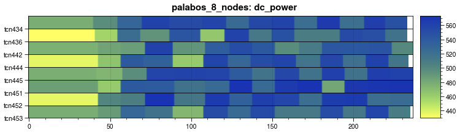
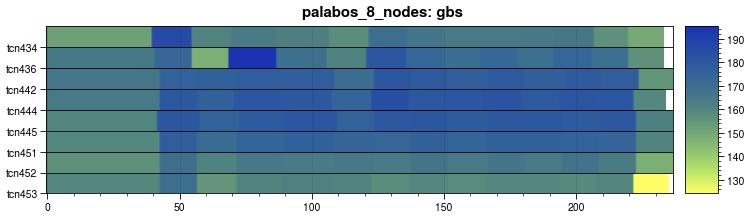
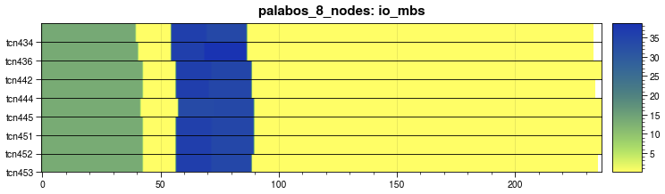

# EAR data visualization
In this tutorial we propose you to play around with EAR data from two points of view: The first one targets job visualization and comparison. To do that we offer you the ear-job-analytics tools. Second one is using Grafana. Grafana is a web browser based tool supporting multiple interfaces. While the first tool generate some static images that can be visualized, used in papers or points, the second one is better to have your own local/remote historical DB.

## Outline

- [ear-job-analytics](#ear-job-analytics)
- [Graphana](#Grafana)

## ear-job-analytics

A tool that automatically reads and visualises data provided by the EAR software. ear-analytics is a cli program written in Python which lets you plot the EAR data given by some of its commands or by using some report plug-in offered by the EAR Library (EARL). The main visualisation target is to show runtime metrics collected by EARL in a timeline graph. 

You can load the tool via the following commands:

```
module load 2023
module load Ear-job-analytics/0.0.1-gfbf-2023a 
```

To create runtime graphs, for example, for jobid 5687690 step 0, you can execute the following command. You can append additional metrics at the end separated by spaces. To see the whole list of metrics execute ear-job-analytics -h

```
ear-job-analytics --format runtime -j 6043213 -s 0 -r -t palabos_8_nodes -o palabos_8.png -m cpi gflops gbs dc_power pck_power perc_mpi io_mbs
```

After that, you will get the following image files;

```
[user@int5 traces]$ ls *palabos_8*
runtime_cpi-palabos_8.png  runtime_dc_power-palabos_8.png  runtime_gbs-palabos_8.png  runtime_gflops-palabos_8.png  runtime_io_mbs-palabos_8.png  runtime_pck_power-palabos_8.png  runtime_perc_mpi-palabos_8.png

```
In that case, the job was a single node job running tensorflow. The graphs looks like 







To help you in the creation of traces we have prepared a script with some pre-defined metrics and options. It is available at /projects/0/energy-course/ear-job-anaytics/create\_trace.sh and [create_trace.sh](../../scripts/create_trace.sh). Execute create\_trace.sh help to see the supported options.  
The tools generates the images using a gradient of colours that can be per-application or per-architecture. If you want to understand/visualize only 1 use case, it is better to use per-application limits, for example:

```
./create_trace.sh 6041751 0 palabos_4_me cpu app
```

But if you want to compare different executions, it is better to use same limits, for example

```
./create_trace.sh 6041751 0 palabos_4_me cpu rome
./create_trace.sh 6041751 1 palabos_4_mon cpu rome
```

In that case, you can compare the execution of step 0, with min\_energy policy with step 1 with  monitoring. When using specific configurations, a json file with limits is used. Some pre-created json files for rome, genoa and gpu partition are available at /projects/0/energy-course/ear-job-anaytics/config\_files and used by the create\_trace.sh script.

## Grafana

EAR data can be visualized with Grafana dashboards in two different ways: Using grafana with SQL queries (depending in you DC configuration) and visualizing data collected with eacct and loading locally. We are going to explain how to install grafana locally and load a CSV file generated with eacct. 

Download and untar Grafana binaries

```
wget https://dl.grafana.com/enterprise/release/grafana-enterprise-10.4.1.linux-amd64.tar.gz
tar -zxvf grafana-enterprise-10.4.1.linux-amd64.tar.gz
```

You can also go to Grafana web page to download specific versions (https://grafana.com/get/?pg=graf&plcmt=hero-btn-1&tab=self-managed https://grafana.com/grafana/download?edition=enterprise&pg=get&plcmt=selfmanaged-box1-cta1)

If needed, update your loca configuration following Grafana documentation (https://grafana.com/docs/grafana/latest/setup-grafana/configure-grafana/)

Start grafana server : sbin/grafana-server web

Install the CSV plugin : 

```
bin/grafana-cli plugins install marcusolsson-csv-datasource (You can first check if it's already available by testing the available Data sources)
```


Enable the CSV pplugin by creating a custom.ini file in the conf folder with the following content

```
[plugin.marcusolsson-csv-datasource]
allow_local_mode = true
```

At this point, you have a local server running on your PC or laptop. Open your web browser and connect to Grafana at the URL: http://localhost:3000/login 
The user/passs by default is admin/admin. You will be prompted to change them but you can skip it.

Next steps are:

- Create the Data source 
- Import the JSON file to create the visualization dashboards
- Copy the CSV files with data for jobs and runtime metrics (must be copied with pre-defined filenames)
- Refresh the URL

### Create the Data source

In the left menu, select Configuration/Data source/Add data source. Select CSV data source from the list of options. 


We will create two data sources, one for application data and the other for runtime metrics (“loops” data). For each one, select “Local” , path has to be a “public” folder, in the example /Users/julita.corbalan/Public/LOGS . Complete and select “Save&test”. The name of the data source cannot be modified and neither the file names with data. 

The name of the application data source is EAR\_apps and the filename is ear\_data\_apps.csv, and the runtime data source is EAR\_loops and the filename ear\_data\_loops.csv


## Import the Dashboard

Go to the left menu, Dashboard, and select the Import option. This option allows to upload or select a json file with pre-specified graphs, tables, etc. Graphs are associated with data sources, this is the reason why the name of the data source cannot be changed.  [EAR data visualization](EAR_job_data_visualization.json)


## Get your data for visualization

Select one of the jobs you have executed during this tutorial, in the example one tensorflow (as GPU example) and Palabos (as CPU use case), In that case you can 
decide the csv filenames since we will copy later in the ear\_data\_apps.csv and ear\_data\_loops.csv files. 

```
eacct -j 5687690 -l -c tensorflow.csv
eacct -j 5687690 -r -c tensorflow_loops.csv
eacct -j 5843328 -l -c palabos.csv
eacct -j 5843328 -r -c palabos_loops.csv
```

Copy from snellius to you local PC or laptop and update the data sources files with data from the application you want to visualize, palabos in the example. 

```
scp your_user@snellius.surf.nl:path_to_palabos_data/palabos*.csv .
scp your_user@snellius.surf.nl:path_to_tensorflow_data/tensorflow*.csv .
cp palabos.csv ear_data_apps.csv
cp palabos_loops.csv ear_data_loops.csv
```

After that, you can refresh the url and palabos data should be visualized.


