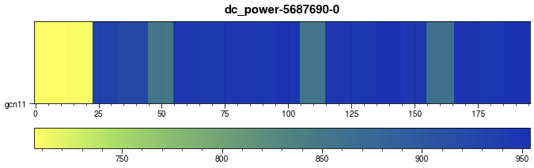

# EAR data visualization
## Grafana
## ear-job-analytics

A tool to automatically read and visualise data provided by the EAR software. ear-analytics is a cli program written in Python which lets you plot the EAR data given by some of its commands or by using some report plug-in offered by the EAR Library (EARL). The main visualisation target is to show runtime metrics collected by EARL in a timeline graph. The ear-job-analytics guide can be found in this link [ear-job-analytics](https://github.com/eas4dc/ear-job-analytics). 

PENDING TO re-generate

You can install the tool locally or in snellius. The zip file to install the tool can be found at /projects/0/energy-course/ear-job-anaytics/ear-job-analytics-main.zip
Unzip the file and execute the following commands

> module load Python/3.10.4-GCCcore-11.3.0
> pip install -U pip
> pip install build setuptools
> python -m build
> pip install .

To create your runtime graphs for example for jobid 5687690 step 0, you can execute the following command (replace tensor with the desired suffix for filenames to be used).Add all the metric at the end separated by spaces. To see the whole list of metrics execute ear-job-analytics -h

> ear-job-analytics --format runtime -j 5687690 -s 0 -l -r -o tensor.png -m cpi gflops gbs dc\_power gpu\_power gpu\_util

After that, you will get the following image files;

[user@int6 ear-job-analytics-main]$ ls \*.png
runtime\_cpi-tensor.png  runtime\_dc\_power-tensor.png  runtime\_gbs-tensor.png  runtime\_gflops-tensor.png  runtime\_gpu\_power-tensor.png  runtime\_gpu\_util-tensor.png

In that case, the job was a single node job running tensorflow. The graphs looks like 

